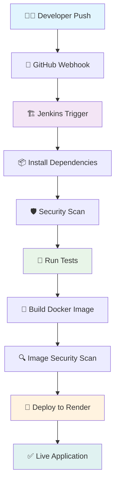

<div align="center">

# 🚀 Flask CI/CD Template
### *Professional DevOps Pipeline with Jenkins & Render*

[](http://YOUR_JENKINS_URL/job/Flask-ci-cd-template/)
[](https://flask-ci-cd-template.onrender.com)
[](https://python.org)
[](https://flask.palletsprojects.com/)
[](LICENSE)

*A complete CI/CD pipeline template featuring automated testing, security scanning, and seamless deployment to production*

</div>

---

## 🌟 **Overview**

This repository showcases a **production-ready Flask web application** with a fully automated CI/CD pipeline. Experience the power of modern DevOps practices with automated testing, security scanning, and zero-downtime deployments.

<div align="center">

### 🎯 **Live Demo**
**[🌐 View Live Application](https://flask-ci-cd-template.onrender.com)**

</div>

---

## ✨ **Key Features**

<table>
<tr>
<td width="50%">

### 🔧 **Backend Excellence**
- 🐍 **Python 3.8+** with Flask framework
- 🔒 **Security-first** approach
- 📦 **Containerized** with Docker
- 🚀 **Production-ready** configuration

</td>
<td width="50%">

### 🎨 **Frontend Elegance**
- 📱 **Responsive** design
- 🎨 **Modern** CSS styling
- ⚡ **JavaScript** interactivity
- 🌙 **Dark theme** interface

</td>
</tr>
<tr>
<td width="50%">

### 🔄 **DevOps Pipeline**
- 🤖 **Automated** CI/CD with Jenkins
- 🧪 **Unit testing** with pytest
- 🛡️ **Security scanning** with Trivy
- 📊 **Code quality** with Flake8

</td>
<td width="50%">

### ☁️ **Cloud Deployment**
- 🌐 **Render** hosting platform
- 🔗 **Webhook** integration
- 📈 **Auto-scaling** capabilities
- 🔧 **Zero-downtime** deployments

</td>
</tr>
</table>

---

## 🛠️ **Technology Stack**

<div align="center">

| Category | Technologies |
|----------|-------------|
| **Backend** |   |
| **Frontend** |    |
| **DevOps** |    |
| **Testing** |   |
| **Security** |   |
| **Hosting** |  |

</div>

---

## 🚀 **Quick Start Guide**

### 📋 **Prerequisites**

Before you begin, ensure you have:

- 🐍 **Python 3.8+** installed
- 📦 **pip** and **venv** available
- 🔧 **Git** for version control

### ⚡ **Installation**

<details>
<summary><b>🔽 Click to expand installation steps</b></summary>

1. **📥 Clone the Repository**
   ```bash
   git clone https://github.com/dileepreddy93/flask-ci-cd-template.git
   cd flask-ci-cd-template
   ```

2. **🔧 Setup Virtual Environment**
   ```bash
   # Create virtual environment
   python3 -m venv venv
   
   # Activate (Linux/macOS)
   source venv/bin/activate
   
   # Activate (Windows)
   venv\Scripts\activate
   ```

3. **📦 Install Dependencies**
   ```bash
   pip install -r requirements.txt
   ```

4. **🚀 Launch Application**
   ```bash
   python app.py
   ```

5. **🌐 Access Application**
   
   Open your browser and navigate to: **[http://127.0.0.1:5000](http://127.0.0.1:5000)**

</details>

---

## 🔄 **CI/CD Pipeline Architecture**

<div align="center">



</div>

### 🔍 **Pipeline Stages**

| Stage | Description | Tools |
|-------|-------------|-------|
| **🔄 Trigger** | Automatic pipeline execution on `main` branch push | GitHub Webhooks |
| **📦 Dependencies** | Clean environment setup with all required packages | pip, venv |
| **🛡️ Security Scan** | Vulnerability assessment of dependencies | pip-audit |
| **🧪 Testing** | Comprehensive unit test execution | pytest |
| **🐳 Build** | Docker image creation and optimization | Docker |
| **🔍 Image Scan** | Container security vulnerability check | Trivy |
| **🚀 Deployment** | Automated deployment to production | Render Deploy Hook |

---

## 🌐 **Deployment Information**

<div align="center">

### 🚀 **Live Application**

**[🌟 Experience the Live Demo](https://flask-ci-cd-template.onrender.com)**

*Automatically updated through our CI/CD pipeline*

[](https://flask-ci-cd-template.onrender.com)

</div>

---

## 🤝 **Contributing**

We welcome contributions! Please see our [Contributing Guidelines](CONTRIBUTING.md) for details.

<div align="center">

### 📫 **Get in Touch**

[](https://github.com/dileepreddy93)
[](https://linkedin.com/in/dileepreddy93)

</div>

---

<div align="center">

### ⭐ **Star this repository if you found it helpful!**

[](https://github.com/dileepreddy93/flask-ci-cd-template/stargazers)
[](https://github.com/dileepreddy93/flask-ci-cd-template/network)

*Made with ❤️ for the DevOps community*

</div>